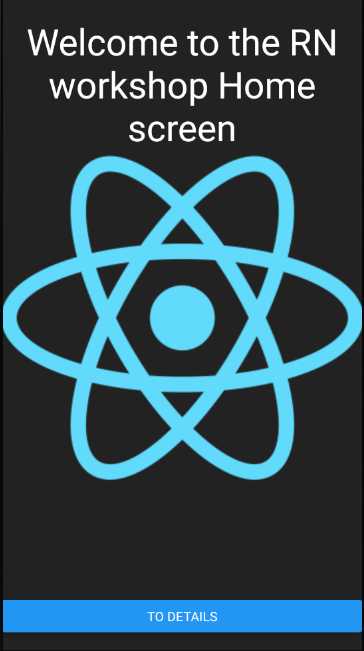
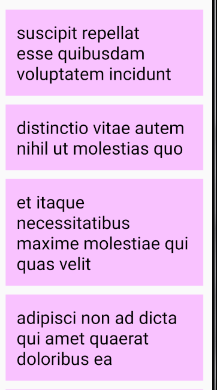
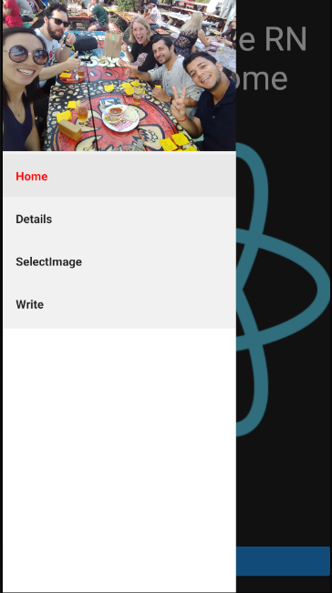
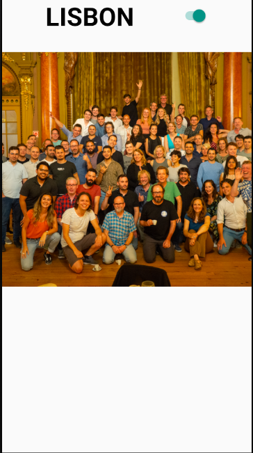
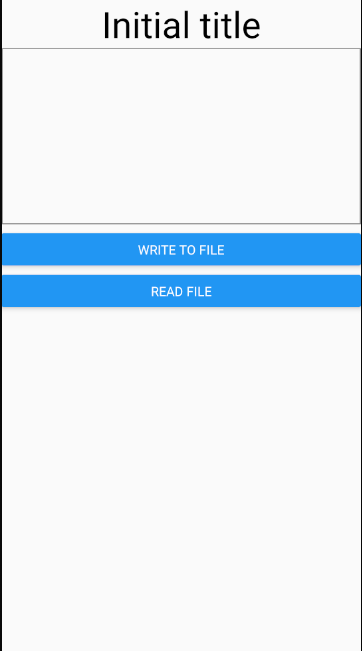

# React - Native Workshop
## Cause
This workshop was made in order to get our hands dirty with [react-native](https://facebook.github.io/react-native/)(and some typescript).  
[React](https://reactjs.org/) knowledge is expected
### Requirements
Please follow the instruction to install the dependecies needed to use react-native-cli in your device:  
https://facebook.github.io/react-native/docs/getting-started

### Getting Started
```
git clone https://github.com/JohnTheo13/RNWorkshop.git
cd RNWorkshop
yarn
```
### Step 1
Create start screen (Home) using the following components:  
with useEffect logging that the app started
```
import {
  Text,
  ImageBackground,
  StyleSheet,
  View,
  Button
} from 'react-native';
```  



### Step 2
Create a new empty screen and use [react-navigation](https://reactnavigation.org/docs/en/hello-react-navigation.html) to move to this screen 

### Step 3
Use ```https://jsonplaceholder.typicode.com/todos?userId=2``` to get some data to create your second screen (don't forget to use ```{ useEffect }```)  

  

### Step 4
Add drawer navigation with:  
```import { createDrawerNavigator } from 'react-navigation-drawer';```   

  

### Step 5 
Add 3d screen with an image switch  



### Step 7
Add [react-native-fs](https://github.com/itinance/react-native-fs)  

### Step 8
Uncomment [fsMethods](./src/utils/fsMethods.ts)

### Step 9
Create last screen which should interact with the filesystem   



### Step 10
Check app on different android devices  

### Step 11
Check app on IOS devices

### Step 12
yarn test
